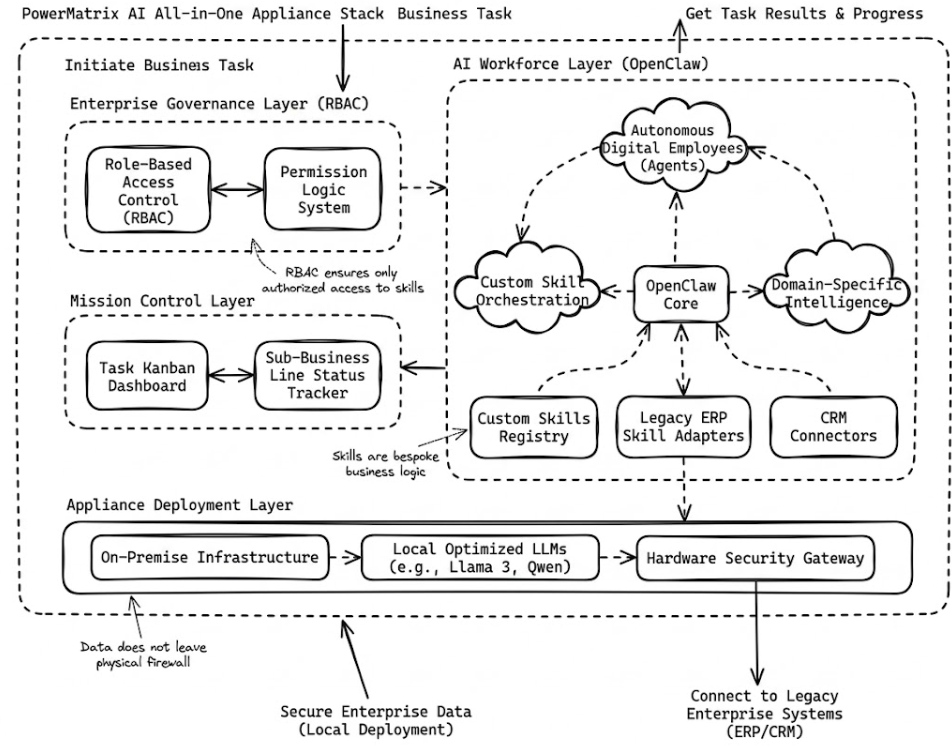

# PowerMatrix: Enterprise-Grade Autonomous Intelligence

PowerMatrix is a deep-tech solution provider dedicated to the **AI-driven digital transformation** of traditional enterprises. We bridge the gap between complex industrial workflows and Large Language Model (LLM) capabilities through our specialized **OpenClaw** framework.

## 🚀 Core Solutions

### 1. The OpenClaw Digital Workforce
Our solutions are built upon **OpenClaw**, an agentic framework designed for high-reliability environments. 
* **Customized Skillsets:** We develop bespoke skills tailored to specific business logic, enabling agents to interface with legacy ERP, CRM, and SCADA systems.
* **Domain-Specific Intelligence:** Our agents don't just "chat"; they execute workflows by calling specialized tools defined by your unique business requirements.

### 2. Enterprise-Ready Adaptation
Standard AI implementations often fail at the enterprise level due to a lack of governance. PowerMatrix solves this with:
* **RBAC (Role-Based Access Control):** A sophisticated permission management system. We ensure that digital employees only access data and trigger skills authorized for their specific organizational role.
* **Mission Control Kanban:** A centralized task management dashboard. Stakeholders can monitor the progress of sub-business lines, track agent execution status, and manage the lifecycle of every autonomous task in real-time.

### 3. Privacy-First Deployment: The PowerMatrix Appliance
For enterprises where data sovereignty is non-negotiable, we offer the **PowerMatrix All-in-One AI Server**:
* **On-Premise Execution:** We deploy optimized open-source models (e.g., Llama 3, Qwen) directly on your local hardware.
* **Data Air-Gapping:** No sensitive corporate data ever leaves your intranet. All inference, fine-tuning, and skill execution happen within your physical firewall, ensuring maximum privacy and security.

---

## 🛠 System Architecture

Below is a conceptual overview of the PowerMatrix stack integration within an enterprise environment:

---

🤝 Contact Us
We are looking to collaborate with industrial partners and AI researchers.

Email: contact@powermatrix.tech

Website: https://www.powermatrix.tech/

© 2026 PowerMatrix. Powering the next generation of industrial intelligence.
